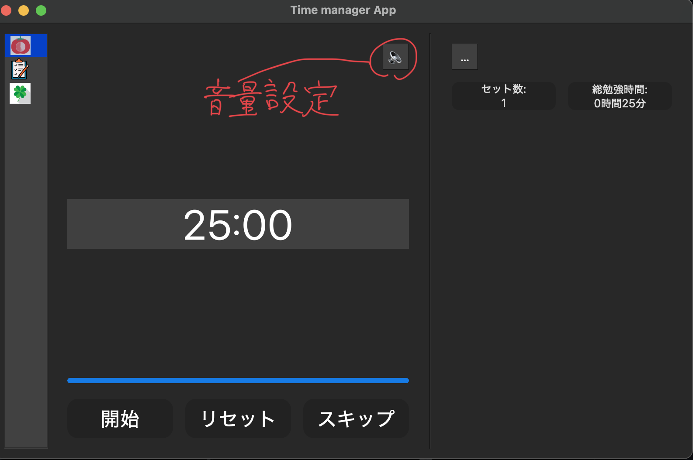
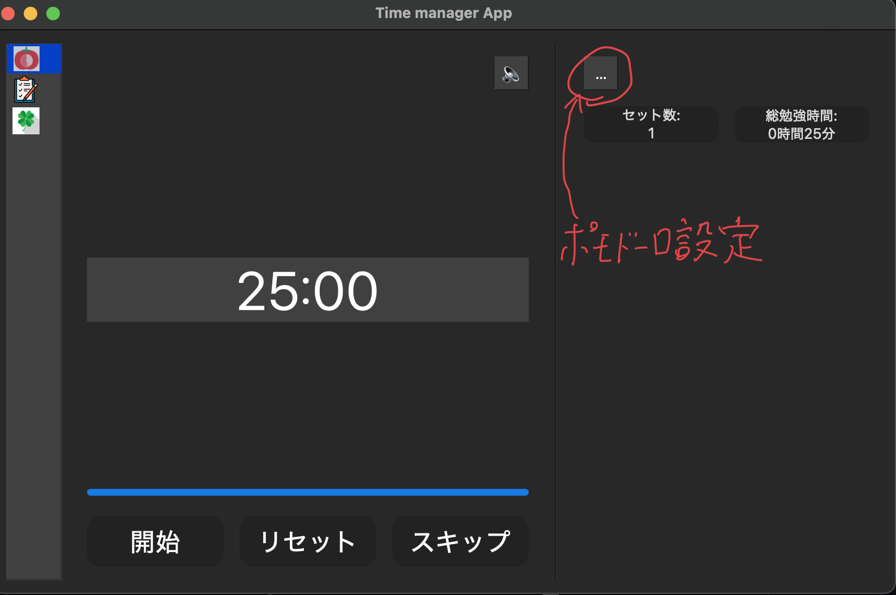
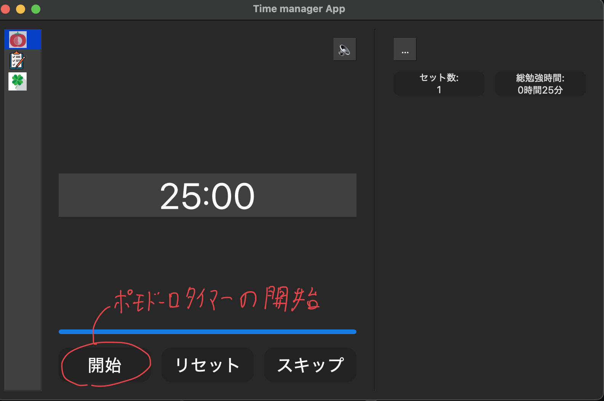

# これはポモドーロタイマーを使ったtask manager applicationです。

## 使い方
### releaseから最新のveresionのzipファイルをダウンロードしてください
### ダウンロードしたらそのzipファイルを解凍していただき, Windows pcであればmain_Windowsを開き、macOS pcであればmain_macOSを開いてください
### ポモドーロの項目には、音量調整ボタン

### ポモドーロの時間と休憩時間の設定ボタン

### 開始ボタンを押すとポモドーロタイマーが開始し、停止ボタンを押すとストップします、リセットボタンを押すと、累計勉強時間、累計ポモドーロ回数を0にリセットします。

### スキップボタンはポモドーロタイマーが進行中の時に押すことができて、押すとそのポモドーロや、休憩時間をスキップします。
## もしzipファイルが動かない場合は制作者に連絡するか、自身でローカルにcloneしていただき次のコマンドをカレントディレクトリをGUIにしてから実行してください
## for mac
### pyinstaller --onefile --add-data 'audio/*.mp3:audio' --add-data 'img/*:img' --hidden-import PyQt6 main.py
## for windows
### pyinstaller --onefile --add-data "audio/*.mp3:audio" --add-data "img/*:img" --hidden-import PyQt6 main.py
