# これはポモドーロタイマーを使ったtask manager applicationです。

## 使い方
### releaseから最新のversionのzipファイルをダウンロードしてください
### ダウンロードしたらそのzipファイルを解凍していただき, Windows pcであればmain_Windowsを開き、macOS pcであればmain_macOSを開いてください
### ポモドーロの項目には、音量調整ボタン
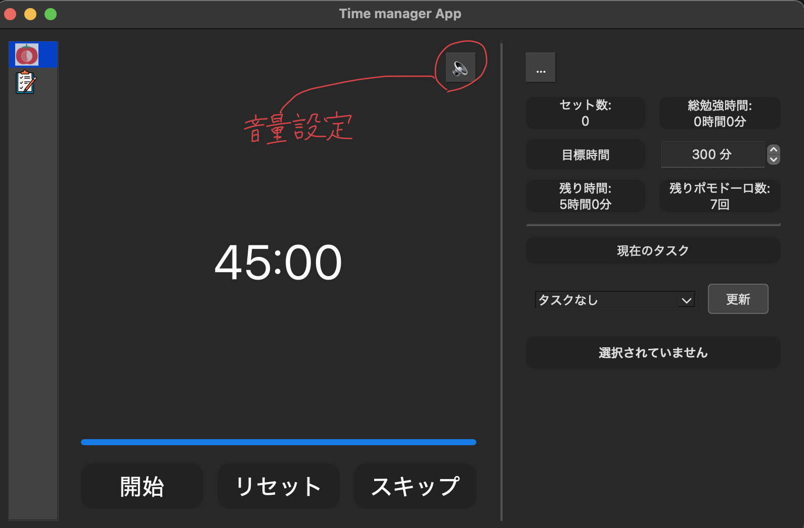
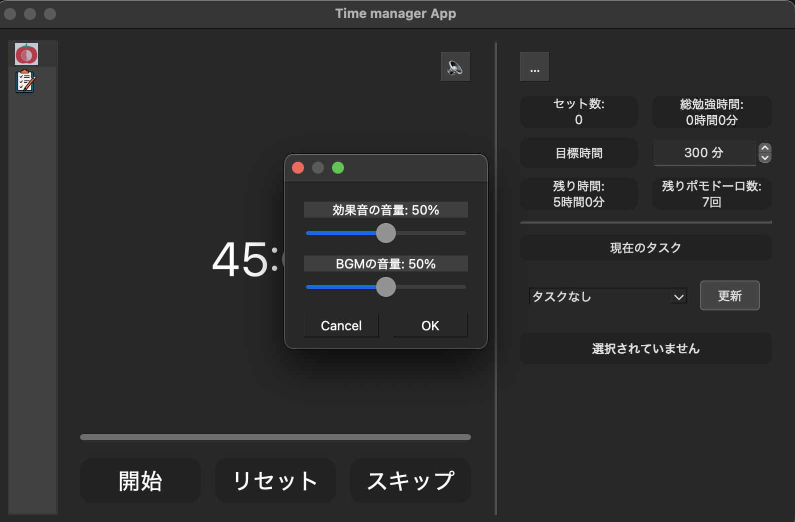

### ポモドーロの時間と休憩時間の設定ボタン
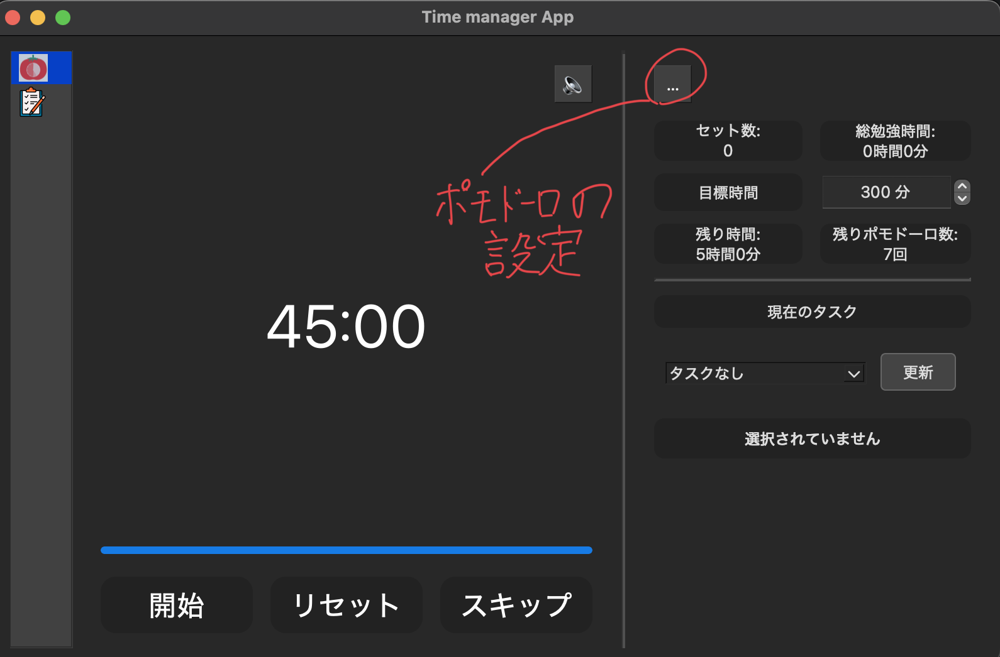
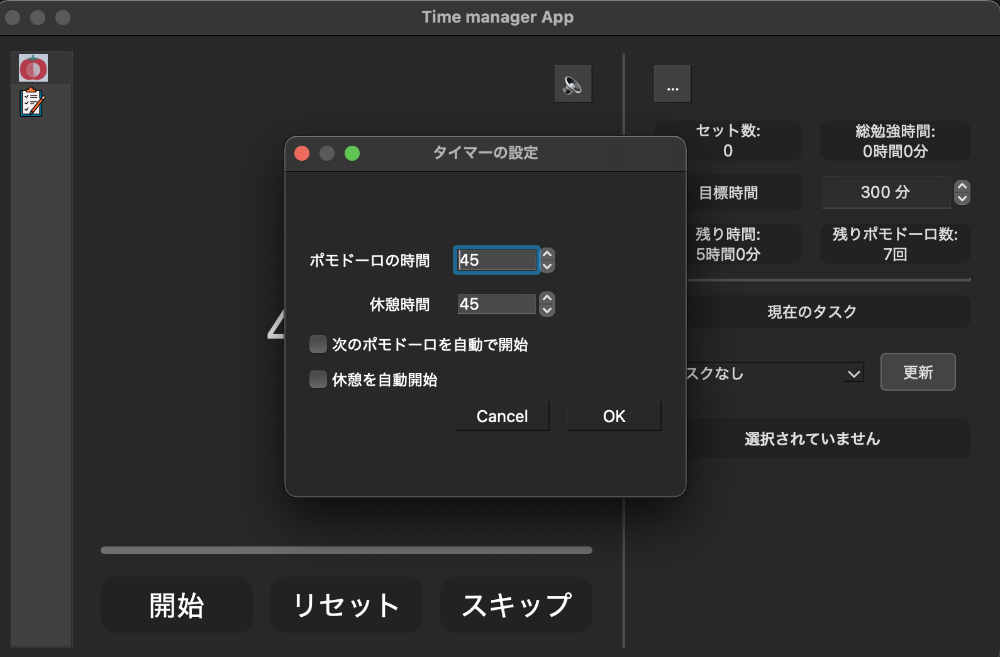

### 開始ボタンを押すとポモドーロタイマーが開始し、停止ボタンを押すとストップします、リセットボタンを押すと、累計勉強時間、累計ポモドーロ回数を0にリセットします。
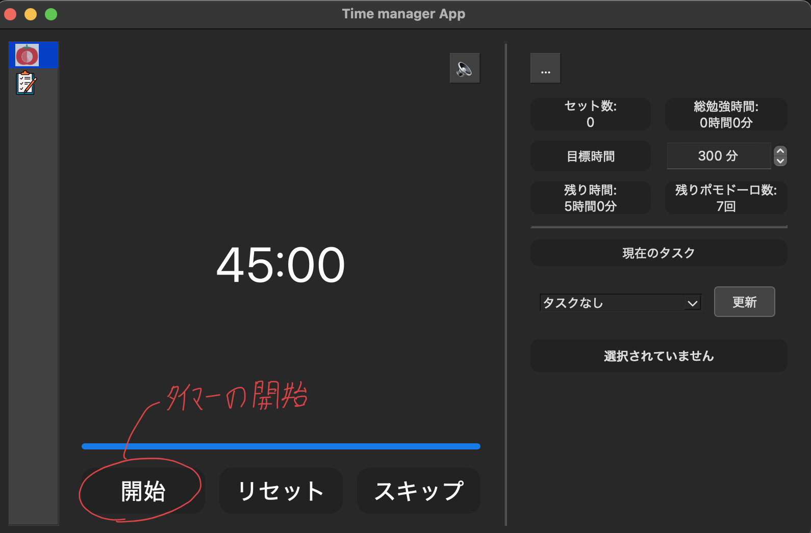
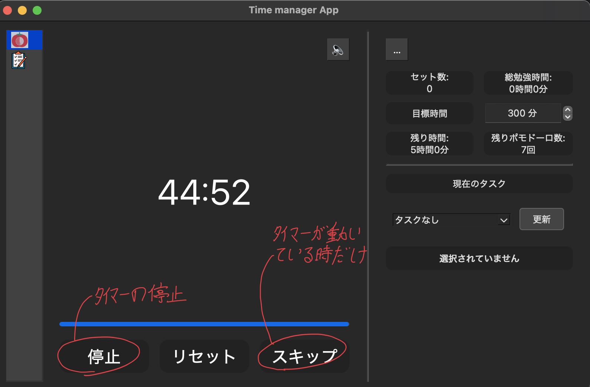

### 目標時間を決めることができます
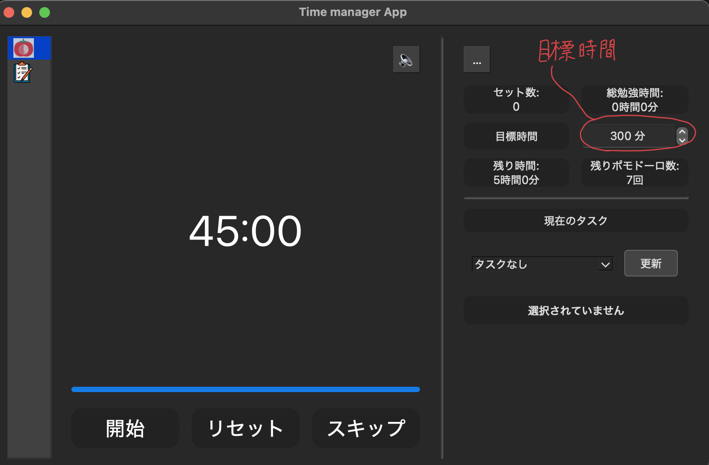

### 左のタスク選択からタスクを選択ことができます（これは下に書いてある、タスクマネージャーでタスクを追加したら使える）
### タスクを選択して、タイマーを開始することでタスクマネージャの方で色々な情報を管理できます
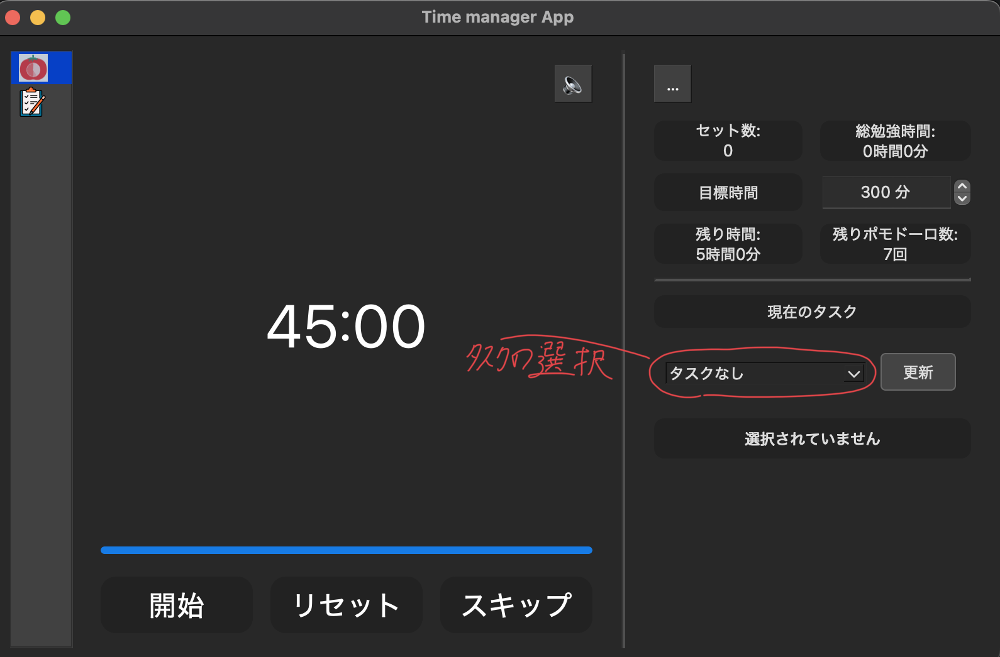

### 左の欄の上から2つ目のタスクを押すとタスクマネージャーに移動します。

### タスクを追加するためには画面中央上にあるタスク追加欄に文字列を記入して、追加ボタンを押すとタスクを追加できます
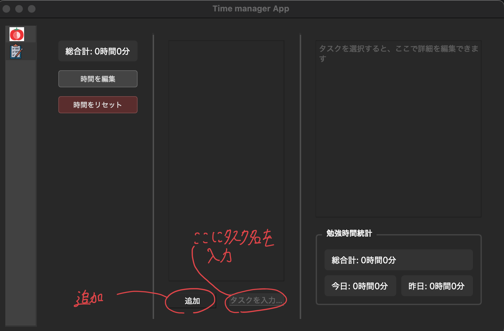
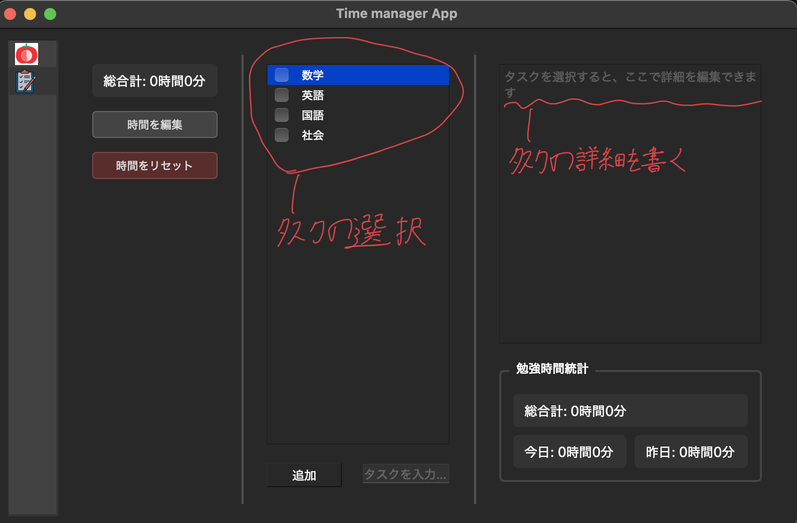

### タスクを追加する際には緊急度と重要度を選択します。　設定すると、タスクの並び替えが行えます
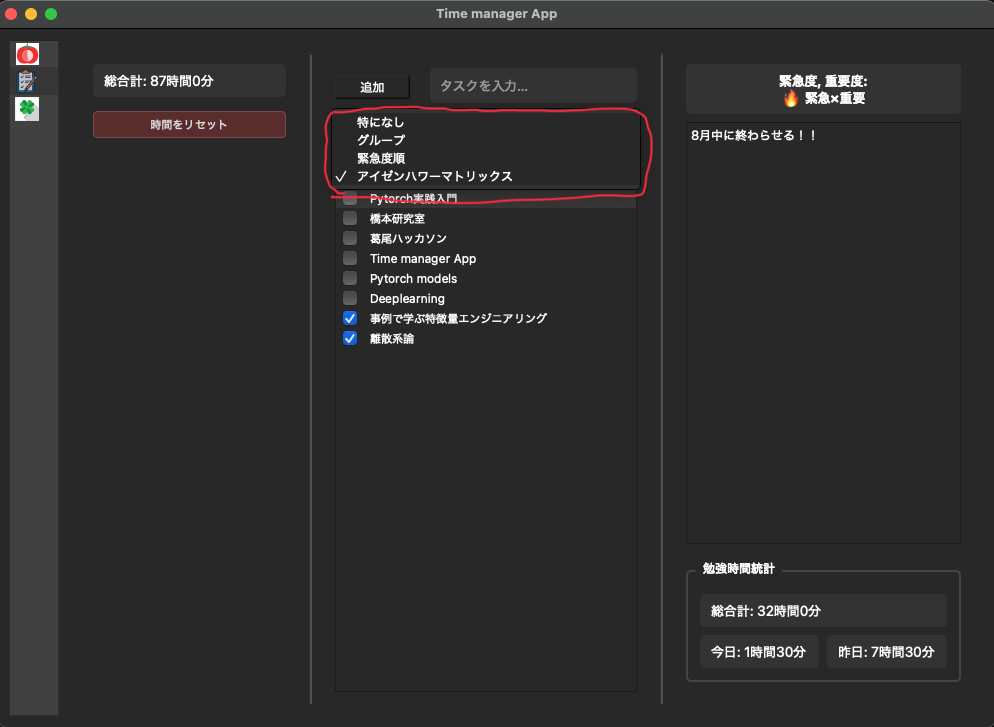

### タスクを選択すると、右下に各タスクの今までの総合計勉強時間、今日の勉強時間、昨日の勉強時間を表示できる
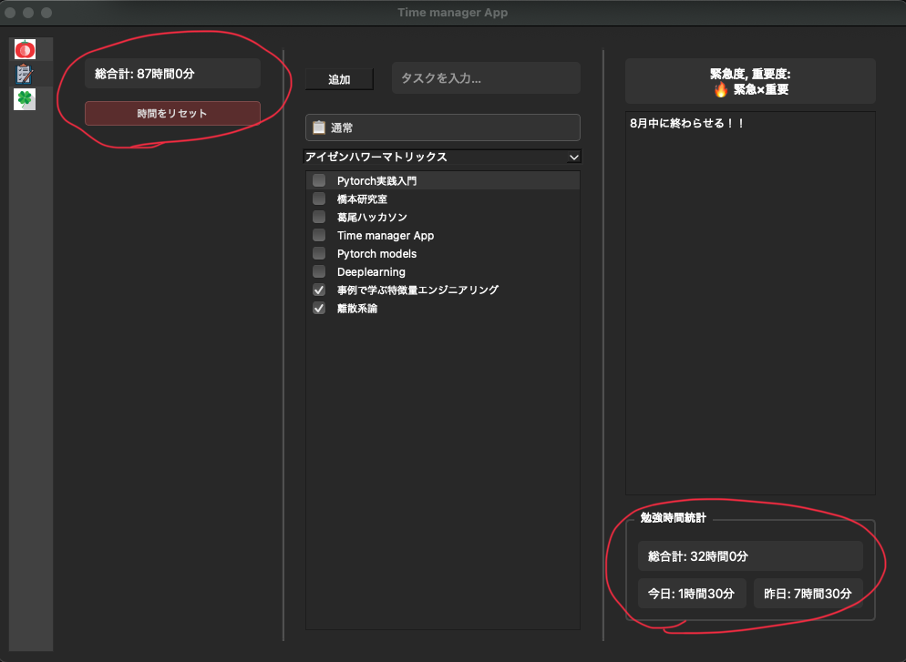

### タスク選択画面で右クリックを押すと編集と削除を行えます
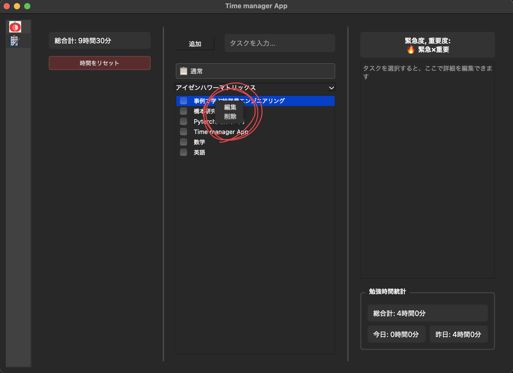

### 左のボタンから全タスクの今までの合計勉強時間を0にリセットすることができます


### 

#　新しいバージョンをダウンロードする前にやっていただきたいこと
### 新しいバージョンに変更した際に今までに追加したデータが消えてしまう可能性があります、そのためバックアップをとっていただきたいです。
### バックアップの仕方は
### 1. Pythonをインストールする, これはバージョンが3.12.9だと望ましいです
### 2.ターミナルで次のコマンドを打つ
```bash
pip install PyQt6
```
### 3.ターミナルで次のコマンドを打つ
```bash
python3 -c "
from PyQt6.QtCore import QSettings
import os

settings = QSettings('CHU1PC', 'TaskManagerApp')

if not os.path.exists(settings.fileName()):
    print('設定ファイルはまだ存在しません')

settings.beginGroup('')
for key in settings.allKeys():
    print(f'  {key}: {settings.value(key)}')
"
```
### もし設定ファイルはまだ存在しませんと表示されたらインストールしてください
### コマンドを打った後にターミナル上に出力される tasks: []の[]の部分をコピーして, restore.pyのtasks = []の[]
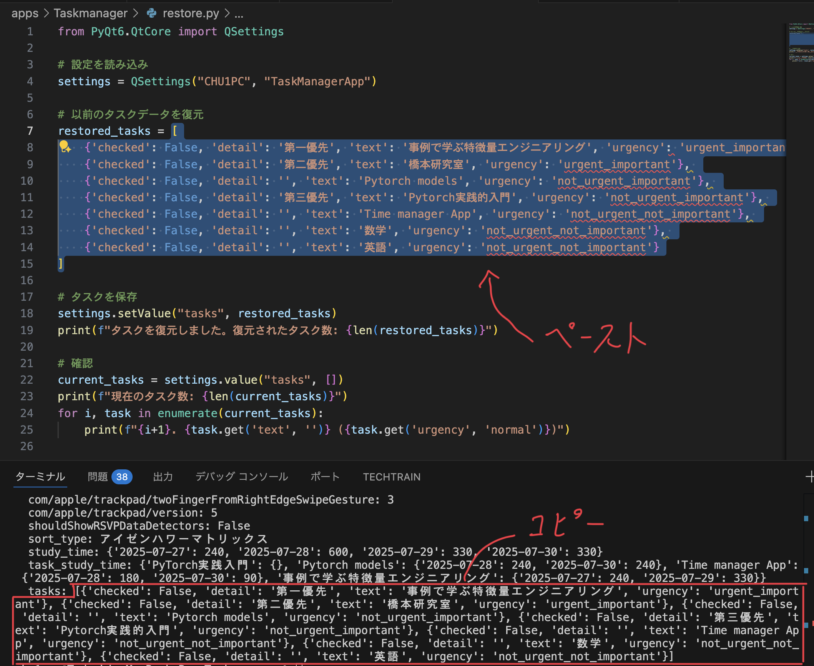

## もしzipファイルが動かない場合は制作者に連絡するか、自身でローカルにcloneしていただき次のコマンドをカレントディレクトリをGUIにしてから実行してください

## for mac
```bash
pyinstaller --onefile --windowed --add-data 'audio/*.mp3:audio' --add-data 'img/*:img' --hidden-import PyQt6 main.py
```
## for windows
```bash
pyinstaller --onefile --windowed --add-data "audio/*.mp3:audio" --add-data "img/*:img" --hidden-import PyQt6 main.py
```
