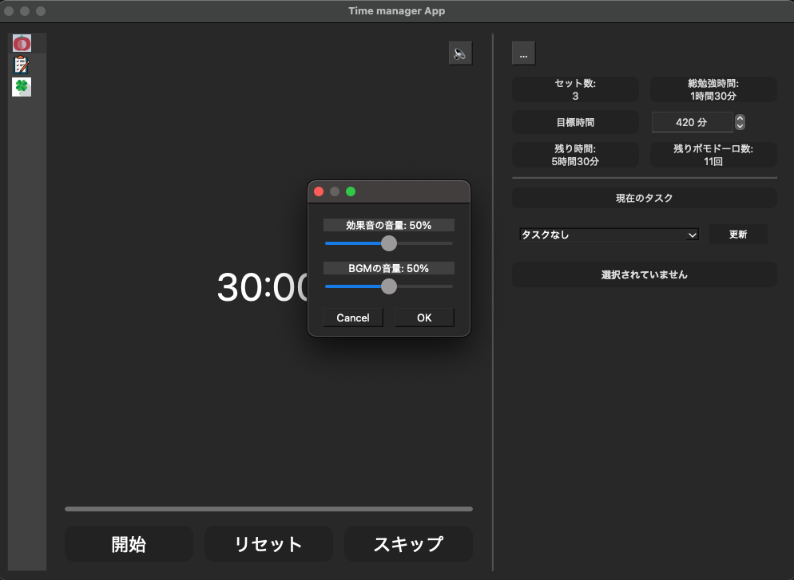
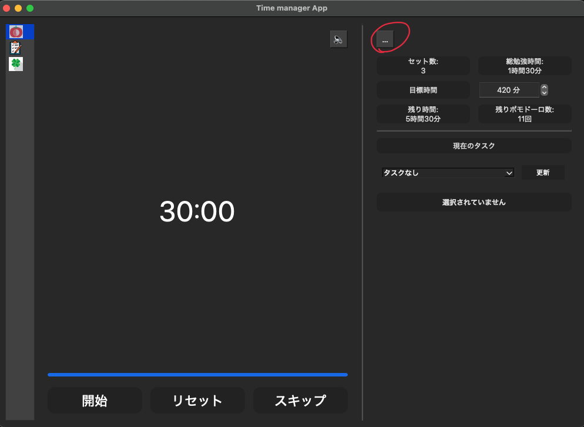
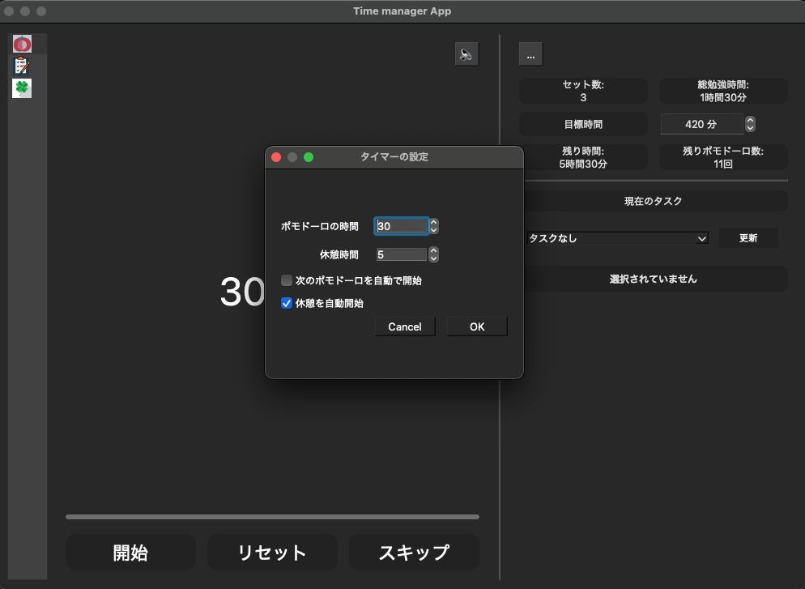
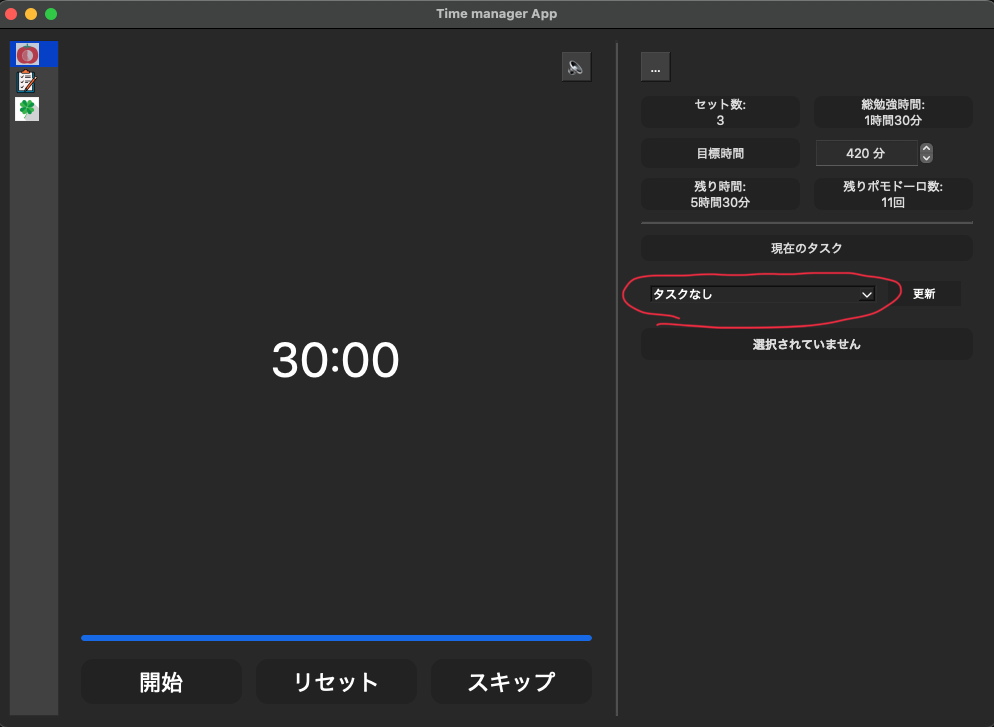
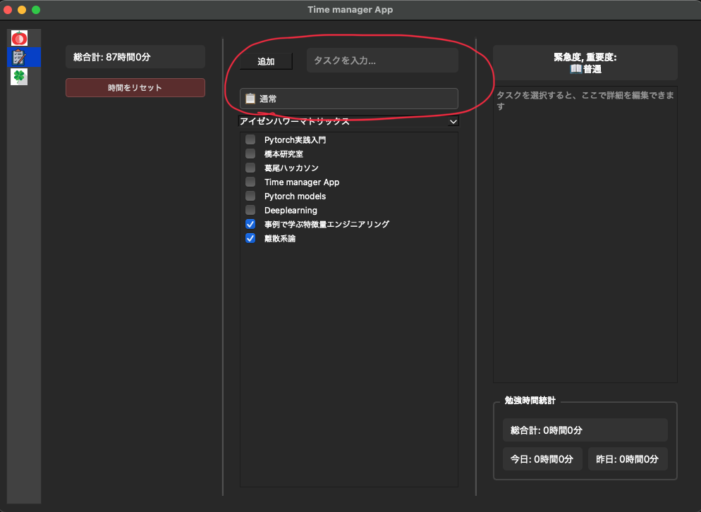

# これはポモドーロタイマーを使ったtask manager applicationです。

## 使い方
### releaseから最新のversionのzipファイルをダウンロードしてください
### ダウンロードしたらそのzipファイルを解凍していただき, Windows pcであればmain_Windowsを開き、macOS pcであればmain_macOSを開いてください
### ポモドーロの項目には、音量調整ボタン



### ポモドーロの時間と休憩時間の設定ボタン



### 開始ボタンを押すとポモドーロタイマーが開始し、停止ボタンを押すとストップします、リセットボタンを押すと、累計勉強時間、累計ポモドーロ回数を0にリセットします。


### 目標時間を決めることができます


### 右のタスク選択からタスクを選択ことができます（これは下に書いてある、タスクマネージャーでタスクを追加したら使える）
### タスクを選択して、タイマーを開始することでタスクマネージャの方で色々な情報を管理できます


### 左の欄の上から2つ目のタスクを押すとタスクマネージャーに移動します。

### タスクを追加するためには画面中央下にあるタスク追加欄に文字列を記入して、追加ボタンを押すとタスクを追加できます



### タスクを選択すると、右下に各タスクの今までの総合計勉強時間、今日の勉強時間、昨日の勉強時間を表示できる


### タスク選択画面で右クリックを押すと編集と削除を行えます


### 左の2つのボタンからその日の合計勉強時間の編集と0にリセットすることができます


## もしzipファイルが動かない場合は制作者に連絡するか、自身でローカルにcloneしていただき次のコマンドをカレントディレクトリをGUIにしてから実行してください

## for mac
```bash
pyinstaller --onefile --windowed --add-data 'audio/*.mp3:audio' --add-data 'img/*:img' --hidden-import PyQt6 main.py
```
## for windows
```bash
pyinstaller --onefile --windowed --add-data "audio/*.mp3:audio" --add-data "img/*:img" --hidden-import PyQt6 main.py
```
